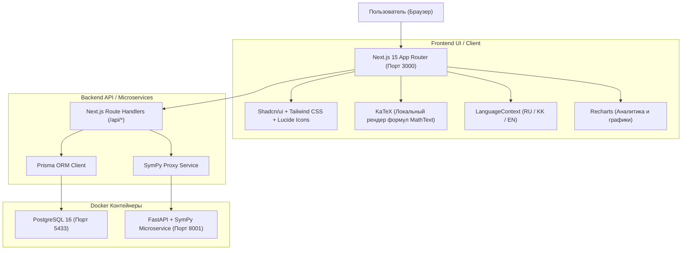

# 🎓 ENT TIPO — Персональная платформа подготовки к ЕНТ ТиПО по математике
> **ТжКБ ҰБТ математикасына арналған дербес жаттықтырушы**  
> *Personalized Math Prep Platform for TVET College Graduates*

---

## 📌 О проекте

**ENT TIPO** — это специализированная обучающая веб-платформа, созданная специально для выпускников колледжей (ТиПО / ТжКБ) по направлению *Software Development*, готовящихся к сдаче ЕНТ по математике.

### 💡 Главная концепция
Это **НЕ** просто сборник типовых тестов. Платформа построена по циклу реального роста знаний:
$$\text{Диагностика} \longrightarrow \text{Выявление слабых тем} \longrightarrow \text{Теория и формулы} \longrightarrow \text{Пошаговая практика} \longrightarrow \text{Символьная проверка} \longrightarrow \text{Анализ типа ошибки} \longrightarrow \text{Статистика и рост сложности}$$

---

## 🚀 Быстрый запуск

### 1. Предварительные требования
* [Docker Desktop](https://www.docker.com/products/docker-desktop/) (запущен)
* [Node.js](https://nodejs.org/) (v18+) & `npm`

### 2. Запуск сервисов через Docker
В корне проекта выполните:
```bash
# Запустить контейнеры базы данных PostgreSQL и математического микросервиса SymPy:
docker start entTIPO_db entTIPO_math

# Или запустить с нуля через Docker Compose:
docker compose up -d
```

Порты контейнеров:
* **PostgreSQL**: `localhost:5433` (пользователь: `postgres`, пароль: `postgres`, БД: `ent_tipo`)
* **Math Validation Service (SymPy / FastAPI)**: `http://localhost:8001`

### 3. Инициализация базы данных и сидинг (при первом запуске)
```bash
# Применить схему базы данных:
npx prisma db push

# Загрузить 15 тем, теорию, вопросы и шаги решений:
npm run db:seed
```

### 4. Запуск веб-приложения Next.js
```bash
npm run dev
```
Откройте браузер по адресу: **[http://localhost:3000](http://localhost:3000)**

---

## 🏗 Архитектура системы



---

## ✨ Что уже реализовано

### 1. 🧮 15 ключевых тем программы ТиПО
Платформа содержит полный каталог из 15 разделов высшей и прикладной математики ЕНТ:
1. **Корни и степени** (Рациональные показатели, свойства корней)
2. **Многочлены** (ФСУ, разложение на множители, деление)
3. **Комплексные числа** (Мнимая единица $i$, модуль, сопряженные числа)
4. **Производная** (Таблица производных, правила, сложная функция)
5. **Касательная к графику** (Геометрический смысл, уравнение $y = f(x_0) + f'(x_0)(x - x_0)$)
6. **Первообразная** (Неопределенный интеграл, нахождение $F(x) + C$)
7. **Интегралы** (Формула Ньютона-Лейбница, вычисление площадей)
8. **Экспоненциальные интегралы** (Интегрирование по частям $\int u \, dv$)
9. **Логарифмические функции** (Свойства логарифмов, уравнения)
10. **Показательные функции** (Уравнения, неравенства с основанием $0 < a < 1$)
11. **Тригонометрия** (Тригонометрический круг, тождества, формулы двойного угла)
12. **Обратные тригонометрические функции** ($\arcsin$, $\arccos$, $\arctan$)
13. **ДУ первого порядка** (Разделение переменных, линейные уравнения)
14. **ДУ второго порядка** (Характеристическое уравнение $ak^2 + bk + c = 0$)
15. **Дробно-линейные функции** (Гиперболы, вертикальные и горизонтальные асимптоты)

### 2. 📖 Детальная теория и математический рендеринг
* **Локальный бандл KaTeX**: Без внешних CDN-зависимостей; формулы рендерятся мгновенно и безошибочно даже офлайн.
* **Компоненты `MathDisplay` и `MathText`**: Автоматическое распознавание LaTeX-формул и встроенной разметки `$..$`.
* **Структура каждого урока**:
  * *Что это такое?* — понятное лаконичное объяснение.
  * *Когда используется в ЕНТ?* — практическая направленность.
  * *Ключевая формула* — чистый LaTeX-блок.
  * *Наглядный пример* — пошаговый математический разбор.
  * *Типичные ошибки на ЕНТ* — разбор подводных камней и ОДЗ.

### 3. 🎯 Адаптивный тренажёр практики
* **Настройка тренировки**: Выбор количества задач (10, 20, 30, 40, 50 или произвольное 1–100).
* **4 режима практики**:
  * 🎲 **Смешанная практика** (адаптивный алгоритм: 40% слабые темы, 25% повторение, 20% случайные, 15% повышенная сложность).
  * ⚠️ **Слабые темы** (фокус на темы с рейтингом ниже 50%).
  * 📚 **Конкретная тема** (точечная отработка выбранного раздела).
  * 🔄 **Повторение ошибок** (решение заданий, где ранее были зафиксированы ошибки).
* **Пошаговое решение заданий**:
  * Вопросы разбиты на логические шаги (выбор метода $\rightarrow$ промежуточные преобразования $\rightarrow$ ответ).
  * Поддержка типов ввода: *Multiple Choice*, *Numeric Input*, *Symbolic Expression Input*.
  * Интерактивный таймер, шкала прогресса, подсказки к шагам.
* **Математическая валидация через SymPy**:
  * Распознавание математической эквивалентности: сервис понимает, что `(x-2)*(x-3)` равно `x^2 - 5*x + 6`, а `1/2` равно `0.5`.
* **Анализ ошибок (7 категорий)**:
  * `wrong_formula` (Неверная формула)
  * `calculation_error` (Арифметическая ошибка)
  * `sign_error` (Ошибка знака)
  * `algebra_error` (Алгебраическая ошибка)
  * `domain_error` (Игнорирование ОДЗ)
  * `concept_error` (Концептуальное непонимание)
  * `incorrect_method` (Неверно выбранный метод решения)

### 4. 📊 Аналитика и статистика
* Динамика изменения точности по дням (Recharts AreaChart с градиентом).
* Распределение уровня освоения по всем 15 темам (Recharts BarChart).
* Расчёт серии непрерывных занятий (Streak) и дневной цели (Daily Goal).
* Выделение сильнейшей темы и зоны ближайшего развития.

### 5. 🌐 Полная трёхъязычность (i18n)
* **Языки**: Русский (`ru`), Казахский (`kk` / `ҚАЗ`), Английский (`en`).
* Мгновенное переключение языка в Header и Sidebar без перезагрузки страницы.
* Полный перевод интерфейса, навигации, каталога тем, всей теории (15 уроков), фильтров и типов ошибок.
* Сохранение выбранного языка в `localStorage`.

### 6. 🎨 UI / UX и темы
* Современный дизайн на базе **Tailwind CSS** и **shadcn/ui**.
* Переключение **светлой** и **тёмной** темы (`next-themes`).
* Мобильная адаптивность с нижней панелью навигации (Mobile Bottom Nav).

---

## 🧪 Сквозной аудит качества

В проект встроен автоматический проверочный скрипт:
```bash
npx tsx scripts/comprehensive_audit.ts
```
**Результаты аудита (150/150 тестов пройдены успешно — 100%):**
* ✅ Рендеринг всех LaTeX-формул через KaTeX (45/45 тестов).
* ✅ Целостность схемы переводов RU/KK/EN (37/37 тестов).
* ✅ Микросервис SymPy и математическая эквивалентность (4/4 теста).
* ✅ Доступность и статус 200 OK для всех веб-страниц и API (13/13 тестов).
* ✅ Полный цикл создания и проверки сессии практики (3/3 теста).
* ✅ Локальный автономный символьный движок JS/TS (4/4 теста: Монте-Карло, дроби, радикалы, тригонометрия).
* ✅ Масштабирование базы вопросов (1/1 тест: 426 задач в PostgreSQL).
* ✅ Интерактивная 2D/3D геометрия и страница `/geometry` (1/1 тест).
* ✅ Мультипользовательская авторизация и API регистрации/входа/профиля (4/4 теста).
* ✅ PWA манифест, Service Worker `/sw.js`, иконки и офлайн-страница (5/5 тестов).

---

## 🚀 Реализованные решения v2 (Устранённые ограничения)

| Область | Было в MVP | Реализовано в v2 |
| :--- | :--- | :--- |
| **Авторизация / Пользователи** | ⚠️ Single-User MVP без экранов логина/регистрации | ✅ **Полноценная аутентификация**: регистрация, вход с хешированием паролей (PBKDF2), безопасные JWT/сессионные куки, эндпоинты `/api/auth/*`, модальное окно, страница `/login` и быстрое переключение между профилями учеников (`UserNav`). |
| **Количество вопросов** | ⚠️ В базе было 34 вопроса (по 2–3 на тему) | ✅ **Масштабирование до 420+ задач**: внедрён алгоритмический генератор вариантов с рандомизацией чисел (`lib/questionGenerator.ts`) и база расширена до **426 детальных пошаговых вопросов** по всем темам. |
| **Геометрические чертежи** | ⚠️ Только аналитический текст и KaTeX, без чертежей | ✅ **Интерактивный чертёжный холст**: SVG-рендеринг стереометрии и планиметрии (`GeometryViewer.tsx`), интерактивная студия `/geometry`, зум, выделение элементов, интеграция в тренировочные вопросы. |
| **Офлайн для SymPy** | ⚠️ Зависимость от Docker; строковое сравнение при сбое | ✅ **Локальный JS математический движок**: встроенный высокоточный символьный парсер и метод Монте-Карло (`lib/mathEngine.ts`), проверяющий эквивалентность формул и тригонометрии даже при выключенном Docker. |
| **PWA / Мобильное приложение** | ⚠️ Без офлайн Service Worker | ✅ **Полноценный PWA**: зарегистрирован Service Worker (`/sw.js`), кэширование KaTeX, стилей и страниц, офлайн-страница `/offline.html`, кнопка установки приложения на смартфон (`PwaRegister.tsx`), иконки 192/512. |

---

## 📂 Структура проекта

```text
entTIPO/
├── app/                        # Next.js 15 App Router
│   ├── (dashboard)/            # Страницы с общим лейаутом
│   │   ├── page.tsx            # Главная (Дашборд)
│   │   ├── practice/           # Тренировка и сессии
│   │   ├── topics/             # Каталог и теория уроков
│   │   ├── mistakes/           # Работа над ошибками
│   │   └── statistics/         # Аналитика и графики
│   ├── api/                    # REST API эндпоинты
│   ├── globals.css             # Стили Tailwind и KaTeX
│   └── layout.tsx              # Корневой лейаут с провайдерами
├── components/                 # React-компоненты
│   ├── dashboard/              # Компоненты дашборда
│   ├── layout/                 # Sidebar, Header, MobileNav, LanguageSwitcher
│   ├── practice/               # QuestionCard, ResultAnalysis, SessionSummary
│   ├── topics/                 # TopicsView, TopicDetailView
│   ├── statistics/             # StatisticsCharts (Recharts)
│   └── ui/                     # UI-кит (MathDisplay, MathText, Button, Card...)
├── lib/                        # Вспомогательная логика
│   ├── i18n/                   # Локализация (LanguageContext, translations, lessons)
│   ├── adaptive.ts             # Алгоритм подбора вопросов
│   ├── mastery.ts              # Расчёт рейтинга мастерства
│   └── prisma.ts               # Клиент Prisma ORM
├── math-service/               # Python FastAPI + SymPy микросервис
│   ├── main.py                 # Эндпоинты валидации формул
│   └── Dockerfile              # Контейнеризация сервиса
├── prisma/                     # База данных
│   ├── schema.prisma           # Схема данных PostgreSQL
│   └── seed.ts                 # Сид 15 тем, теории и вопросов
└── scripts/                    # Скрипты аудита и проверки
    └── comprehensive_audit.ts  # Сквозной тест 135 проверок
```

---

## 🛠 Полезные команды

```bash
# Проверка типов TypeScript
npx tsc --noEmit

# Запуск сквозного аудита
npx tsx scripts/comprehensive_audit.ts

# Открыть GUI базы данных (Prisma Studio)
npx prisma studio

# Перезапуск контейнеров Docker
docker restart entTIPO_db entTIPO_math
```
