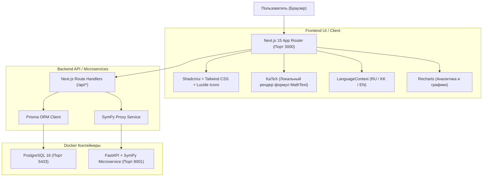

# 🎓 ENT TIPO — Персональная платформа подготовки к ЕНТ ТиПО по математике
> **ТжКБ ҰБТ математикасына арналған дербес жаттықтырушы**  
> *Personalized Math Prep Platform for TVET College Graduates*

---

## 📌 О проекте

**ENT TIPO** — это специализированная обучающая веб-платформа, созданная специально для выпускников колледжей (ТиПО / ТжКБ) по направлению *Software Development*, готовящихся к сдаче ЕНТ по математике.

Подтверждённый целевой профиль — математика для **B057 «Информационные технологии», сокращённый срок обучения**, по опубликованной НЦТ спецификации **с 2023 года**, проверенной 04.10.2026. Полное соответствие пока не подтверждено: прямое покрытие есть у 18/20 пунктов, 28 задач требуют проверки; для нескольких независимых вариантов банка недостаточно. [Официальные источники, методика и оставшиеся пробелы](docs/exam-specification-coverage.md). Живой аудит доступен на `/exam-coverage`.

### 💡 Главная концепция
Это **НЕ** просто сборник типовых тестов. Платформа построена по циклу реального роста знаний:
$$\text{Диагностика} \longrightarrow \text{Выявление слабых тем} \longrightarrow \text{Теория и формулы} \longrightarrow \text{Пошаговая практика} \longrightarrow \text{Символьная проверка} \longrightarrow \text{Анализ типа ошибки} \longrightarrow \text{Статистика и рост сложности}$$

---

## 🚀 Быстрый запуск

### 1. Предварительные требования
* [Docker Desktop](https://www.docker.com/products/docker-desktop/) (запущен)
* [Node.js](https://nodejs.org/) (v18+) & `npm`

### 2. Запуск сервисов через Docker
В корне проекта выполните:
```bash
# Запустить контейнеры базы данных PostgreSQL и математического микросервиса SymPy:
docker start entTIPO_db entTIPO_math

# Или запустить с нуля через Docker Compose:
docker compose up -d
```

Порты контейнеров:
* **PostgreSQL**: `localhost:5433` (пользователь: `postgres`, пароль: `postgres`, БД: `ent_tipo`)
* **Math Validation Service (SymPy / FastAPI)**: `http://localhost:8001`

### 3. Инициализация базы данных и сидинг (при первом запуске)
```bash
# Применить схему базы данных:
npx prisma db push

# Загрузить 15 тем, теорию, вопросы и шаги решений:
npm run db:seed
```

### 4. Запуск веб-приложения Next.js
```bash
npm run dev
```
Откройте браузер по адресу: **[http://localhost:3000](http://localhost:3000)**

---

## 🏗 Архитектура системы

### План дня и подтверждённая проработка (этап 5)

На главной — сохраняемый план: конкретное правило, три задачи и одна
самостоятельная проверка. Он учитывает диагностику, ошибки, подсказки,
давность и выполненную сегодня работу. Просмотр разбора хранится отдельно
от подтверждения: ошибку закрывает правильное решение другой подходящей
задачи без помощи и ранее раскрытого ответа. Повторения назначаются через
1, 3, 7 и 14 дней в зоне ученика (по умолчанию Asia/Qyzylorda).

Обновление существующей базы без сброса (остановить приложение):

```powershell
npx prisma db execute --file prisma/updates/20261004_daily_learning_plan.sql --schema prisma/schema.prisma
npm run db:generate
npm run db:skills
```

Проверки: `npm run test:plan:unit`, `npm run test:plan`.
Правила и ограничения: [docs/daily-learning-plan.md](docs/daily-learning-plan.md).

### Диагностика навыков (этап 4)

На `/diagnostics` добавлена входная диагностика из 9 заданий на свойства
степеней, цепное правило и знаки при раскрытии скобок. Каталог и связи
задач/шагов хранятся явно; отчёт показывает конкретные ошибки, ответы,
правило и подходящее задание. Прогресс навыков учитывает частичные ответы,
подсказки, повторы, давность и достаточность наблюдений. Результаты
изолированы по аккаунтам, диагностика восстанавливается после обновления,
повторные отправки не удваивают наблюдения. Подсказки отключены, эталоны
доступны после завершения. Обычные тренировки сохраняют прежнее оценивание.

Обновление существующей базы без сброса истории (приложение остановить,
затем запустить снова):

```bash
npx prisma db execute --file prisma/updates/20261004_skill_diagnostics.sql --schema prisma/schema.prisma
npm run db:generate
npm run db:skills
```

Новые проверки: `npm run test:skills:unit` и `npm run test:skills`.
Подробности банка, алгоритма, миграции и ограничений:
[docs/skill-diagnostics.md](docs/skill-diagnostics.md).

### Восстановление тренировки (этап 3)

Список и порядок заданий сохраняются в базе при создании сессии. Страница
`/practice/session/<id>` восстанавливает текущую позицию, незаконченные ответы,
результат проверки или итог завершённой тренировки. На странице практики
появился список незавершённых тренировок с кнопкой «Продолжить».

Ответы сохраняются автоматически. На текущем устройстве каждое изменение
также сразу записывается в локальную копию, привязанную к аккаунту и сессии:
обновление или закрытие страницы до завершения автосохранения не теряет ввод.
Сохранённые на сервере ответы доступны после входа на другом устройстве.
Запоздавшие записи из другой вкладки отклоняются по версии состояния.

UUID и данные неподтверждённой отправки сохраняются локально. После возврата
можно повторить ту же отправку без дополнительной попытки. Если сервер уже
проверил решение, страница сразу восстанавливает сохранённый разбор.

Выдача заданий не содержит `correctAnswer`, `expectedAnswer`, объяснения
решения или `isCorrect` у вариантов. Эталоны и объяснение приходят в результате
проверки. Подсказки выдаются отдельным запросом с учётом их использования.
Проверять и получать подсказки можно только для заданий, выбранных в эту сессию.

Обновление существующей базы без сброса данных (при работающем сервере сначала
остановите его, затем после команд запустите снова):

```bash
npx prisma db execute --file prisma/updates/20261004_persistent_practice.sql --schema prisma/schema.prisma
npm run db:generate
```

Для старых сессий, у которых список ранее был только в URL, скрипт восстанавливает
состав из решённых заданий и дополняет его заданиями той же темы. История попыток
сохраняется. Ввод, потерянный до установки этого обновления, восстановить невозможно.
Повторное выполнение скрипта не изменяет уже сохранённые списки и позиции.
Для новой базы по-прежнему достаточно обычного `db:push` и первоначального сидинга.

Проверки этапа (для API нужны запущенное приложение и база):

```bash
npm run test:session:unit
npm run test:session
```

Они проверяют черновики, восстановление позиции и разбора, повторные отправки,
изоляцию аккаунтов, конфликты сохранения, отсутствие эталонов в заданиях и
совместимость обновления базы. API-проверка создаёт временные данные и удаляет
их после завершения; также проверяет повторное применение SQL-обновления.
Локальная копия защищает ввод при обрыве соединения; загрузке заданий и проверке
решений по-прежнему нужен сервер. Полная офлайн-практика остаётся отдельным этапом.

### Учёт прогресса и повторных ответов (этап 2)

Mastery Score получает последние десять попыток в порядке от старой к новой;
сложность меняется по последним пяти результатам. Сохраняются существующие
штрафы за подсказку и повторную попытку в одной тренировке.

Подсказки к шагам открываются кнопкой. Открытие записывается на сервере для
задачи и сессии, включая успешные AI-подсказки и просмотр сохранённой подсказки
AI. При повторном решении этой задачи помощь продолжает учитываться.

Счётчики задач считают разные `questionId`: один раз за сессию, один раз за
день в дневной цели и один раз за всё время в общей статистике. Учитывается
задача с отправленным решением. `correctCount` сессии считает задачи, которые
были решены правильно хотя бы в одной попытке. Отдельные `totalAttempts`
(общая статистика) и `attemptCount` (сессия) показывают все сохранённые попытки.
Точность — доля полностью правильных попыток среди всех попыток.

`POST /api/attempts` требует `submissionId` (UUID) и ровно один непустой
ответ на каждый шаг задачи. Повторная отправка того же UUID и данных возвращает
исходный результат, даже после завершения сессии. Изменённые данные с тем же
UUID получают `409`; новая осознанная попытка использует новый UUID.
При сетевой ошибке интерфейс повторяет исходные данные и UUID.

Для обновления существующей базы без сброса истории:

```bash
npx prisma db execute --file prisma/updates/20261004_attempt_tracking.sql --schema prisma/schema.prisma
npm run db:generate
```

Скрипт только добавляет поля и индексы. Исторические попытки сохраняются;
счётчики задач при чтении рассчитываются по их истории. Полный перерасчёт
старых Mastery Score не запускается: исправленный алгоритм применяется
при следующей попытке.

Проверки этапа (для API нужен работающий сервер и БД):

```bash
npm run test:progress:unit
npm run test:progress
npm run test:auth:unit
npm run test:auth
```

API-проверки создают отдельные временные аккаунты и вопросы, проверяют
параллельные запросы, подсказки, повторы, статистику и затем удаляют свои данные.

### Личные аккаунты и деморежим

Для личных тренировок необходим вход или регистрация. Прогресс, сессии, попытки,
ошибки и история AI-диалогов разделены по аккаунтам. Заголовок `X-User-Id` не
используется для авторизации. Вход в профили без установленного пароля запрещён.

Перед запуском в production задайте в `.env` приватный `SESSION_SECRET`.
Сгенерировать значение можно командой:

```bash
node -e "console.log(require('crypto').randomBytes(32).toString('hex'))"
```

В режиме разработки без этой переменной ключ генерируется в памяти; после
перезапуска сервера потребуется повторный вход.

Демоверсия отключена по умолчанию. Для её включения задайте
`ENABLE_DEMO_MODE="true"` и выполните обычное первоначальное заполнение БД.
Кнопка «Попробовать демоверсию» на странице входа открывает только отдельный
демопрофиль. Его учебные данные общие для пользователей демоверсии и не
переносятся в личный аккаунт при регистрации.

Service Worker кеширует статические ресурсы и офлайн-страницу. Персональные
страницы и API-ответы не сохраняются в общем браузерном кеше.

Проверка изоляции двух аккаунтов на запущенном локальном сервере:

```bash
npm run test:auth
```

Проверка создаёт временные аккаунты и учебные записи и удаляет только свои
данные после завершения. Для проверки демоверсии сервер запускают с
`ENABLE_DEMO_MODE="true"`.



---

## ✨ Что уже реализовано

### 1. 🧮 Учебный каталог математики
Исходный каталог содержит 15 учебных тем; этап 6.1 добавляет поверхности и объёмы тел. Этот список не доказывает полноту официальной программы; соответствие проверяется по конкретным задачам:
1. **Корни и степени** (Рациональные показатели, свойства корней)
2. **Многочлены** (ФСУ, разложение на множители, деление)
3. **Комплексные числа** (Мнимая единица $i$, модуль, сопряженные числа)
4. **Производная** (Таблица производных, правила, сложная функция)
5. **Касательная к графику** (Геометрический смысл, уравнение $y = f(x_0) + f'(x_0)(x - x_0)$)
6. **Первообразная** (Неопределенный интеграл, нахождение $F(x) + C$)
7. **Интегралы** (Формула Ньютона-Лейбница, вычисление площадей)
8. **Экспоненциальные интегралы** (Интегрирование по частям $\int u \, dv$)
9. **Логарифмические функции** (Свойства логарифмов, уравнения)
10. **Показательные функции** (Уравнения, неравенства с основанием $0 < a < 1$)
11. **Тригонометрия** (Тригонометрический круг, тождества, формулы двойного угла)
12. **Обратные тригонометрические функции** ($\arcsin$, $\arccos$, $\arctan$)
13. **ДУ первого порядка** (Разделение переменных, линейные уравнения)
14. **ДУ второго порядка** (Характеристическое уравнение $ak^2 + bk + c = 0$)
15. **Дробно-линейные функции** (Гиперболы, вертикальные и горизонтальные асимптоты)

### 2. 📖 Детальная теория и математический рендеринг
* **Локальный бандл KaTeX**: Без внешних CDN-зависимостей; формулы рендерятся мгновенно и безошибочно даже офлайн.
* **Компоненты `MathDisplay` и `MathText`**: Автоматическое распознавание LaTeX-формул и встроенной разметки `$..$`.
* **Структура каждого урока**:
  * *Что это такое?* — понятное лаконичное объяснение.
  * *Когда используется?* — практическая направленность.
  * *Ключевая формула* — чистый LaTeX-блок.
  * *Наглядный пример* — пошаговый математический разбор.
  * *Типичные ошибки* — разбор подводных камней и ОДЗ.

### 3. 🎯 Адаптивный тренажёр практики
* **Настройка тренировки**: Выбор количества задач (10, 20, 30, 40, 50 или произвольное 1–100).
* **4 режима практики**:
  * 🎲 **Смешанная практика** (адаптивный алгоритм: 40% слабые темы, 25% повторение, 20% случайные, 15% повышенная сложность).
  * ⚠️ **Слабые темы** (фокус на темы с рейтингом ниже 50%).
  * 📚 **Конкретная тема** (точечная отработка выбранного раздела).
  * 🔄 **Повторение ошибок** (решение заданий, где ранее были зафиксированы ошибки).
* **Пошаговое решение заданий**:
  * Вопросы разбиты на логические шаги (выбор метода $\rightarrow$ промежуточные преобразования $\rightarrow$ ответ).
  * Поддержка типов ввода: *Multiple Choice*, *Numeric Input*, *Symbolic Expression Input*.
  * Интерактивный таймер, шкала прогресса, подсказки к шагам.
* **Математическая валидация через SymPy**:
  * Распознавание математической эквивалентности: сервис понимает, что `(x-2)*(x-3)` равно `x^2 - 5*x + 6`, а `1/2` равно `0.5`.
* **Анализ ошибок (7 категорий)**:
  * `wrong_formula` (Неверная формула)
  * `calculation_error` (Арифметическая ошибка)
  * `sign_error` (Ошибка знака)
  * `algebra_error` (Алгебраическая ошибка)
  * `domain_error` (Игнорирование ОДЗ)
  * `concept_error` (Концептуальное непонимание)
  * `incorrect_method` (Неверно выбранный метод решения)

### 4. 📊 Аналитика и статистика
* Динамика изменения точности по дням (Recharts AreaChart с градиентом).
* Распределение уровня освоения по всем 15 темам (Recharts BarChart).
* Расчёт серии непрерывных занятий (Streak) и дневной цели (Daily Goal).
* Выделение сильнейшей темы и зоны ближайшего развития.

### 5. 🌐 Полная трёхъязычность (i18n)
* **Языки**: Русский (`ru`), Казахский (`kk` / `ҚАЗ`), Английский (`en`).
* Мгновенное переключение языка в Header и Sidebar без перезагрузки страницы.
* Полный перевод интерфейса, навигации, каталога тем, всей теории (15 уроков), фильтров и типов ошибок.
* Сохранение выбранного языка в `localStorage`.

### 6. 🎨 UI / UX и темы
* Современный дизайн на базе **Tailwind CSS** и **shadcn/ui**.
* Переключение **светлой** и **тёмной** темы (`next-themes`).
* Мобильная адаптивность с нижней панелью навигации (Mobile Bottom Nav).

---

## 🧪 Сквозной аудит качества

В проект встроен автоматический проверочный скрипт:
```bash
npx tsx scripts/comprehensive_audit.ts
```
**Результаты аудита (150/150 тестов пройдены успешно — 100%):**
* ✅ Рендеринг всех LaTeX-формул через KaTeX (45/45 тестов).
* ✅ Целостность схемы переводов RU/KK/EN (37/37 тестов).
* ✅ Микросервис SymPy и математическая эквивалентность (4/4 теста).
* ✅ Доступность и статус 200 OK для всех веб-страниц и API (13/13 тестов).
* ✅ Полный цикл создания и проверки сессии практики (3/3 теста).
* ✅ Локальный автономный символьный движок JS/TS (4/4 теста: Монте-Карло, дроби, радикалы, тригонометрия).
* ✅ Масштабирование базы вопросов (1/1 тест: 426 задач в PostgreSQL).
* ✅ Интерактивная 2D/3D геометрия и страница `/geometry` (1/1 тест).
* ✅ Мультипользовательская авторизация и API регистрации/входа/профиля (4/4 теста).
* ✅ PWA манифест, Service Worker `/sw.js`, иконки и офлайн-страница (5/5 тестов).

---

## 🚀 Реализованные решения v2 (Устранённые ограничения)

| Область | Было в MVP | Реализовано в v2 |
| :--- | :--- | :--- |
| **Авторизация / Пользователи** | ⚠️ Single-User MVP без экранов логина/регистрации | ✅ Регистрация, вход с PBKDF2 и подписанными сессионными cookie, проверка владельца личных данных, страница `/login` и отдельный управляемый деморежим. |
| **Количество вопросов** | ⚠️ В базе было 34 вопроса (по 2–3 на тему) | ✅ **Масштабирование до 420+ задач**: внедрён алгоритмический генератор вариантов с рандомизацией чисел (`lib/questionGenerator.ts`) и база расширена до **426 детальных пошаговых вопросов** по всем темам. |
| **Геометрические чертежи** | ⚠️ Только аналитический текст и KaTeX, без чертежей | ✅ **Интерактивный чертёжный холст**: SVG-рендеринг стереометрии и планиметрии (`GeometryViewer.tsx`), интерактивная студия `/geometry`, зум, выделение элементов, интеграция в тренировочные вопросы. |
| **Офлайн для SymPy** | ⚠️ Зависимость от Docker; строковое сравнение при сбое | ✅ **Локальный JS математический движок**: встроенный высокоточный символьный парсер и метод Монте-Карло (`lib/mathEngine.ts`), проверяющий эквивалентность формул и тригонометрии даже при выключенном Docker. |
| **PWA / Мобильное приложение** | ⚠️ Без офлайн Service Worker | ✅ Service Worker кеширует публичные статические ресурсы и офлайн-страницу. Для личных страниц и API требуется сеть. Есть кнопка установки приложения (`PwaRegister.tsx`). |

---

## 📂 Структура проекта

```text
entTIPO/
├── app/                        # Next.js 15 App Router
│   ├── (dashboard)/            # Страницы с общим лейаутом
│   │   ├── page.tsx            # Главная (Дашборд)
│   │   ├── practice/           # Тренировка и сессии
│   │   ├── topics/             # Каталог и теория уроков
│   │   ├── mistakes/           # Работа над ошибками
│   │   └── statistics/         # Аналитика и графики
│   ├── api/                    # REST API эндпоинты
│   ├── globals.css             # Стили Tailwind и KaTeX
│   └── layout.tsx              # Корневой лейаут с провайдерами
├── components/                 # React-компоненты
│   ├── dashboard/              # Компоненты дашборда
│   ├── layout/                 # Sidebar, Header, MobileNav, LanguageSwitcher
│   ├── practice/               # QuestionCard, ResultAnalysis, SessionSummary
│   ├── topics/                 # TopicsView, TopicDetailView
│   ├── statistics/             # StatisticsCharts (Recharts)
│   └── ui/                     # UI-кит (MathDisplay, MathText, Button, Card...)
├── lib/                        # Вспомогательная логика
│   ├── i18n/                   # Локализация (LanguageContext, translations, lessons)
│   ├── adaptive.ts             # Алгоритм подбора вопросов
│   ├── mastery.ts              # Расчёт рейтинга мастерства
│   └── prisma.ts               # Клиент Prisma ORM
├── math-service/               # Python FastAPI + SymPy микросервис
│   ├── main.py                 # Эндпоинты валидации формул
│   └── Dockerfile              # Контейнеризация сервиса
├── prisma/                     # База данных
│   ├── schema.prisma           # Схема данных PostgreSQL
│   └── seed.ts                 # Сид 15 тем, теории и вопросов
└── scripts/                    # Скрипты аудита и проверки
    └── comprehensive_audit.ts  # Сквозной тест 135 проверок
```

---

## 🛠 Полезные команды

```bash
# Проверка типов TypeScript
npx tsc --noEmit

# Запуск сквозного аудита
npx tsx scripts/comprehensive_audit.ts

# Открыть GUI базы данных (Prisma Studio)
npx prisma studio

# Перезапуск контейнеров Docker
docker restart entTIPO_db entTIPO_math
```

## Экзаменационный режим (этап 6.2)

`/exam` запускает и возобновляет математический блок подтверждённого профиля
`ntc-tipo-b057-math-2023@1.0.0`: 20 заданий, A/B/C = 5/10/5, максимум 20 баллов.
Время, состав, ответы и результат сохраняются на сервере; помощь запрещена
до завершения, повторный запрос завершения не дублирует оценивание.
Отдельный официальный лимит математики не опубликован: 30/40/120 минут в
интерфейсе — явно обозначенные учебные настройки. Доступен проверенный
банк на русском и казахском. Результат подключён к персональному плану и Mastery навыков;
тренировочная статистика сохраняет отдельный учёт.

Миграция, проверки, правила оценивания, границы покрытия и влияние на план
описаны в [docs/exam-mode.md](docs/exam-mode.md).

## Казахский учебный контент (этап 6.3)

Казахский доступен во всём основном пути: диагностика, теория, практика,
разбор ошибок, персональный план, математический экзамен и результат.
Переведены условия, шаги, варианты, подсказки и объяснения 508 доступных задач,
15 уроков и правила 23 навыков. IDs, ответы, оценивание и история едины для RU/KK.
Переключение языка сохраняет незавершённую тренировку. KK экзамен допускает
только полный актуальный перевод без русской подмены.

Повторяемая миграция, заполнение `npm run db:kazakh`, аудит `npm run content:audit`,
проверки и границы языковой валидации описаны в
[docs/kazakh-learning-content.md](docs/kazakh-learning-content.md).

## Офлайн-практика (этап 6.4)

На `/practice` доступна явная загрузка пакетов RU/KK с правилами, материалами,
заданиями и ресурсами KaTeX. Скачанная тренировка открывается без сети,
сохраняет ответы и курсор в IndexedDB и восстанавливается после закрытия.
Очередь со стабильными UUID синхронизируется после возвращения интернета;
сервер перепроверяет ответы и не дублирует попытки при потере квитанции.
Конфликты и устаревшие пакеты сохраняют работу до явного решения ученика.

Локальная проверка предварительная; символьные выражения ожидают сервера.
Это отдельная практика с доступными устройству эталонами и учётом помощи.
Экзамен и самостоятельное подтверждение ошибки остаются онлайн.
Миграция, сценарии, ограничения и проверки описаны в
[docs/offline-practice.md](docs/offline-practice.md).
